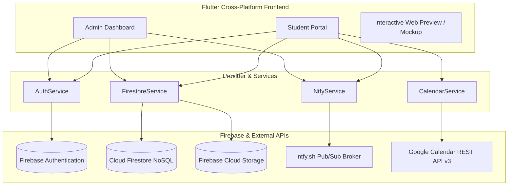
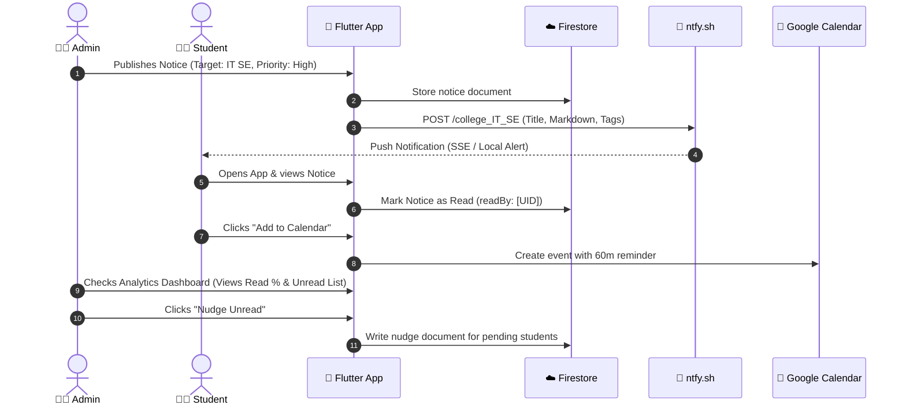

# 🎓 College Noticeboard — Smart Notice Intelligence & Event Management

[](https://collegenoticeboard-49628.web.app)
[](https://flutter.dev)
[](https://dart.dev)
[](https://firebase.google.com)
[](https://ntfy.sh)
[](https://developers.google.com/calendar)
[](https://flutter.dev)
[](https://github.com/dhruvdhandukiya/CollegeNoticeBoard)

> **A Next-Generation, Role-Based College Noticeboard System** built with Flutter, Firebase, ntfy.sh, and Google Calendar. Features multi-tier notice targeting, real-time push alerts via Server-Sent Events (SSE), notice read-receipt analytics, one-tap student nudging, and automated calendar event sync.

🌐 **Live Web Application**: [https://collegenoticeboard-49628.web.app](https://collegenoticeboard-49628.web.app)

---

## 📌 Table of Contents

- [🌐 Live Application](#-live-application)
- [✨ Key Features](#-key-features)
- [🏗️ System Architecture](#️-system-architecture)
- [👥 User Roles & Workflow](#-user-roles--workflow)
- [📊 Database & Firestore Schema](#-database--firestore-schema)
- [📁 Project Structure](#-project-structure)
- [🔔 Notification Architecture (ntfy.sh)](#-notification-architecture-ntfysh)
- [📅 Google Calendar Synchronization](#-google-calendar-synchronization)
- [🚀 Getting Started & Installation](#-getting-started--installation)
- [🌐 Web Platform & Firebase Configuration](#-web-platform--firebase-configuration)
- [📝 Latest Changelog & Commit History](#-latest-changelog--commit-history)
- [🤝 Contributing & License](#-contributing--license)

---

## 🌐 Live Application

Access the live deployed web version directly:
👉 **[https://collegenoticeboard-49628.web.app](https://collegenoticeboard-49628.web.app)**

---

## ✨ Key Features

### 🎯 1. Granular Audience Targeting
- **Multi-Level Visibility Filtering**: Target notices to:
  - **All Students** (Campus-wide broadcasts)
  - **Multi-Department & Year Filters** (Intersection/Matrix filtering e.g., `IT` + `CS` in `TE` & `BE`)
  - **Specific Committees** (CSI, NSS, IETE, Students Council, Codecell, CodeTantra, CodeStorm)
  - **Handpicked Individual Students** (Direct delivery to selected student UIDs)

### 📊 2. Real-Time Analytics & Read-Receipt Tracking
- **Live Read-Rate Percentage**: Admin can track how many students have viewed a notice in real time.
- **Audience Segmentation**: Break down recipient lists into **Read** vs. **Not Read**.
- **1-Tap Nudge Mechanism**: Send direct alert reminders to unread recipients with a single click.

### ⚡ 3. Dual-Channel Real-Time Push Notifications (`ntfy.sh`)
- Zero-overhead push notification pipeline powered by `ntfy.sh`.
- **Web SSE (`EventSource`)**: Instant browser push notifications with desktop alert popups.
- **Mobile Push**: Background polling and local notification integration via `flutter_local_notifications`.
- **Intelligent Topic Hierarchy**: Auto-subscribes users based on department, year, and committee (`college_dept_IT`, `college_year_SE`, `college_IT_SE`, `college_all`).

### 📅 4. 1-Tap Google Calendar Synchronization
- Connects seamlessly with Google Identity Services (GIS) OAuth 2.0.
- Converts notice deadlines and college events directly into Google Calendar entries.
- **Priority-Driven Auto-Reminders**:
  - `Urgent`: 30-minute reminder
  - `High`: 1-hour reminder
  - `Medium`: 2-hour reminder
  - `Low`: 24-hour reminder

### 🚨 5. Urgent Notice Priority Interruption
- Notices flagged as `Urgent` trigger an unavoidable modal dialog upon student sign-in until acknowledged.
- Prominent color coding throughout the UI (`Urgent` 🔴, `High` 🟠, `Medium` 🔵, `Low` 🟢).

### 🎟️ 6. Event Management & RSVP
- Complete campus event lifecycle: Venue, Date/Time, Organizer, and Live Attendee RSVP Counter.
- PDF Brochure upload & storage via **Firebase Storage**.

### ⌛ 7. Notice Lifecycle & Auto-Expiry
- Notices can be scheduled with custom or preset lifespans (`12 Hours`, `24 Hours`, `3 Days`, `7 Days`, `Custom Date/Time`).
- Automatically hides expired notices from student feeds and runs auto-deletion cleanup.

---

## 🏗️ System Architecture



---

## 👥 User Roles & Workflow



---

## 📊 Database & Firestore Schema

### 1. `users` Collection
| Field | Type | Description |
|---|---|---|
| `uid` | `String` | Unique Firebase User ID |
| `name` | `String` | Full student/admin name |
| `email` | `String` | College email address |
| `role` | `String` | `'admin'` \| `'student'` \| `'committee'` |
| `department` | `String` | `'IT'`, `'CS'`, `'AIDS'`, `'EXTC'`, `'MECH'`, `'CHEMICAL'` |
| `year` | `String` | `'FE'`, `'SE'`, `'TE'`, `'BE'` |
| `committee` | `String?` | Optional: `'CSI'`, `'NSS'`, `'Codecell'`, etc. |
| `rollNumber` | `String?` | Student Roll Number |
| `phone` | `String?` | Contact phone number |
| `isActive` | `bool` | Account activation flag |
| `createdAt` | `Timestamp` | Account creation timestamp |

### 2. `notices` Collection
| Field | Type | Description |
|---|---|---|
| `title` | `String` | Notice title |
| `description` | `String` | Notice details & markdown content |
| `category` | `String` | `'Academics'`, `'Event'`, `'Exam'`, `'Placement'`, etc. |
| `visibility` | `String` | `'all'`, `'multi'`, `'department'`, `'year'`, `'committee'`, `'specific'` |
| `targetDepartments` | `List<String>` | Targeted departments |
| `targetYears` | `List<String>` | Targeted academic years |
| `targetCommittee` | `String?` | Targeted committee name |
| `targetStudentUids` | `List<String>` | Selected individual student UIDs |
| `priority` | `String` | `'low'`, `'medium'`, `'high'`, `'urgent'` |
| `isImportant` | `bool` | High priority badge flag |
| `isPinned` | `bool` | Pins notice to the top of the feed |
| `expiresAt` | `Timestamp?` | Expiry deadline timestamp |
| `readBy` | `List<String>` | UIDs of students who opened the notice |
| `requiresAcknowledgement` | `bool` | Requires student acknowledgement |
| `acknowledgedBy` | `List<String>` | UIDs of students who acknowledged |
| `createdAt` | `Timestamp` | Notice timestamp |

### 3. `events` Collection
| Field | Type | Description |
|---|---|---|
| `title` | `String` | Event Title |
| `description` | `String` | Event details |
| `venue` | `String` | Location / Auditorium |
| `eventDate` | `Timestamp` | Scheduled date & time |
| `organizer` | `String` | Committee or department hosting |
| `pdfUrl` | `String?` | Download URL for brochure PDF |
| `rsvpCount` | `int` | Real-time attendee counter |
| `rsvpUsers` | `List<String>` | Array of user IDs RSVP'd |

### 4. `nudges` Collection
| Field | Type | Description |
|---|---|---|
| `noticeId` | `String` | Reference to notice |
| `targetUid` | `String` | UID of unread student |
| `seen` | `bool` | Seen status indicator |
| `createdAt` | `Timestamp` | Server timestamp |

---

## 📁 Project Structure

```
notice_board_app/
├── lib/
│   ├── main.dart                       # App entry point, MultiProvider setup, theme init
│   ├── firebase_options.dart           # Firebase configuration for Web, Android, iOS
│   ├── models/
│   │   ├── user_model.dart             # UserModel definition, roles, Firestore serialization
│   │   └── notice_model.dart           # NoticeModel, priority enum, expiry helpers
│   ├── services/
│   │   ├── auth_service.dart           # Firebase Auth, account creation, input validation
│   │   ├── firestore_service.dart      # CRUD for Users, Notices, Events, Nudges, RSVP
│   │   ├── ntfy_service.dart           # ntfy.sh pub/sub, SSE listeners, Web notifications
│   │   ├── calendar_service.dart       # Google Identity Services (GIS) & Calendar REST API
│   │   └── fcm_service.dart            # Firebase Cloud Messaging fallback handler
│   ├── screens/
│   │   ├── splash_screen.dart          # Session check and role-based redirect
│   │   ├── login_screen.dart           # Authentication UI with strict input sanitization
│   │   ├── admin/
│   │   │   ├── admin_dashboard_screen.dart # 3-Tab dashboard: Students, Notices, Events
│   │   │   ├── add_notice_screen.dart      # Notice builder with audience matrix & expiry
│   │   │   ├── add_student_screen.dart     # Student account generation & credential viewer
│   │   │   ├── add_event_screen.dart       # Event creator with PDF brochure uploader
│   │   │   ├── notice_analytics_screen.dart# Read % stats, read/unread tabs, 1-tap nudge
│   │   │   └── event_detail_screen.dart    # Admin event overview & RSVP viewer
│   │   └── student/
│   │       ├── student_home_screen.dart    # Student Feed, Urgent alerts, Calendar triggers
│   │       └── event_detail_screen.dart    # Event RSVP, brochure viewer, GCal sync
│   └── utils/
│       └── app_theme.dart              # Custom design system, color palette & typography
├── preview/
│   └── index.html                      # Standalone interactive browser preview & mockup
├── web/
│   ├── index.html                      # Web wrapper with Google GIS & Firebase scripts
│   └── firebase-config.js              # Web CORS and Firebase initialization bridge
├── pubspec.yaml                        # Dependencies and Flutter SDK constraints
└── FIREBASE_FIXES.md                   # Firebase & Google Calendar integration guide
```

---

## 🔔 Notification Architecture (ntfy.sh)

The application utilizes **[ntfy.sh](https://ntfy.sh)** for lightweight, serverless real-time push notifications without requiring complex APNs/FCM server keys:

```
                  ┌─────────────────────────────────────────┐
                  │ Admin publishes notice for IT TE        │
                  └────────────────────┬────────────────────┘
                                       │ HTTP POST
                                       ▼
                  ┌─────────────────────────────────────────┐
                  │ ntfy.sh/college_IT_TE                   │
                  │ Headers: Title, Priority, Tags, Actions │
                  └────────────┬──────────────────┬─────────┘
                               │                  │
                Server-Sent    │                  │ HTTP Stream /
                Events (SSE)   │                  │ Webhooks
                               ▼                  ▼
                    ┌──────────────────┐  ┌──────────────────┐
                    │ Web Client       │  │ Mobile Client    │
                    │ EventSource API  │  │ Local Notification│
                    └──────────────────┘  └──────────────────┘
```

### Topic Conventions
- Campus Broadcast: `college_all`
- Department Broadcast: `college_dept_<DEPT>` (e.g. `college_dept_IT`)
- Year Broadcast: `college_year_<YEAR>` (e.g. `college_year_TE`)
- Cohort Intersection: `college_<DEPT>_<YEAR>` (e.g. `college_IT_TE`)
- Committee Channel: `college_committee_<COMMITTEE>` (e.g. `college_committee_CSI`)

---

## 📅 Google Calendar Synchronization

Google Calendar integration allows students to export notices and deadlines directly into their personal calendar.

1. **OAuth 2.0 via GIS**:
   - Uses Google Identity Services (`https://accounts.google.com/gsi/client`).
   - Scopes: `https://www.googleapis.com/auth/calendar.events`.
2. **REST API Event Dispatch**:
   - Sends direct JSON payloads to `https://www.googleapis.com/calendar/v3/calendars/primary/events`.
3. **Smart Priority Mapping**:
   - Color codes and popup reminders are automatically tailored to the notice's urgency level.

---

## 🚀 Getting Started & Installation

### Prerequisites
- **Flutter SDK**: `^3.0.0` or higher
- **Dart SDK**: `^3.0.0 <4.0.0`
- **Firebase CLI**: `npm install -g firebase-tools`
- **Google Chrome** (for Web testing) or **Android/iOS Simulator**

### 1. Clone the Repository
```bash
git clone https://github.com/dhruvdhandukiya/CollegeNoticeBoard.git
cd CollegeNoticeBoard
```

### 2. Install Dependencies
```bash
flutter pub get
```

### 3. Configure Firebase
Ensure your Firebase project is configured:
```bash
# If configuring for the first time:
flutterfire configure
```

### 4. Run the Application

#### Run on Web:
```bash
flutter run -d chrome
```

#### Run on Mobile (Android / iOS):
```bash
flutter run -d android
# or
flutter run -d ios
```

---

## 🌐 Web Platform & Firebase Configuration

For web hosting and local browser testing, verify the following configuration in `web/index.html`:

- **Google OAuth Client ID**:
  ```html
  <meta name="google-signin-client_id" content="174103157478-fh80l432rsdqj5ph3dpvgpt686umpenb.apps.googleusercontent.com">
  ```
- **Firebase Web Scripts**:
  ```html
  <script src="https://www.gstatic.com/firebasejs/10.8.0/firebase-app-compat.js"></script>
  <script src="https://www.gstatic.com/firebasejs/10.8.0/firebase-auth-compat.js"></script>
  <script src="https://www.gstatic.com/firebasejs/10.8.0/firebase-firestore-compat.js"></script>
  ```

---

## 📝 Latest Changelog & Commit History

| Commit | Type | Summary of Changes |
|---|---|---|
| `f8cb0b4` | **Fix** | Final header sanitization for browser compatibility (stripped non-ASCII characters from HTTP headers sent to `ntfy.sh`). |
| `148f4f9` | **Fix** | Formatted push notification payloads with markdown bold headings and category tags. |
| `4024865` | **Fix** | Added automatic browser notification permission request (`Notification.requestPermission()`) on Web initialization. |
| `971cf6c` | **Revert** | Reverted lowercase topic enforcement to preserve camelCase / acronym committee identifiers. |
| `da26c58` | **Fix** | Enhanced audience targeting matrix with multi-department and multi-year intersection filters. |
| `c471acd` | **Feat** | Upgraded `ntfy.sh` SSE pub/sub notification logic and integrated standalone interactive web preview (`preview/index.html`). |
| `d80ef14` | **Feat** | Completed core application features: Google Calendar OAuth integration, notice read-receipt analytics, student nudging, and auto-expiry. |

---

## 🤝 Contributing

1. Fork the Project
2. Create your Feature Branch (`git checkout -b feature/AmazingFeature`)
3. Commit your Changes (`git commit -m 'feat: Add some AmazingFeature'`)
4. Push to the Branch (`git push origin feature/AmazingFeature`)
5. Open a Pull Request

---

## 📄 License

Distributed under the MIT License. See `LICENSE` for more information.
